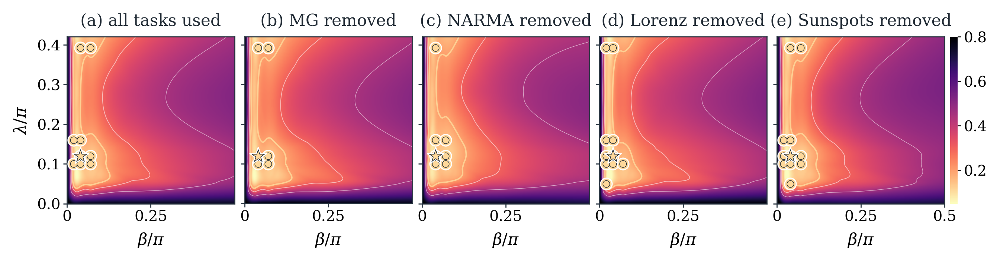
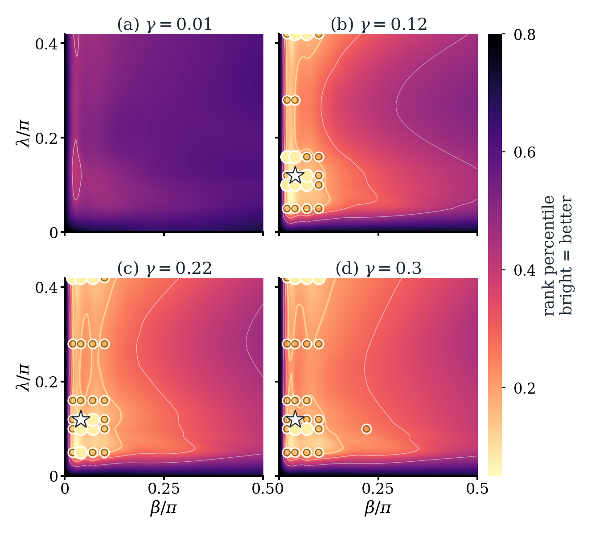
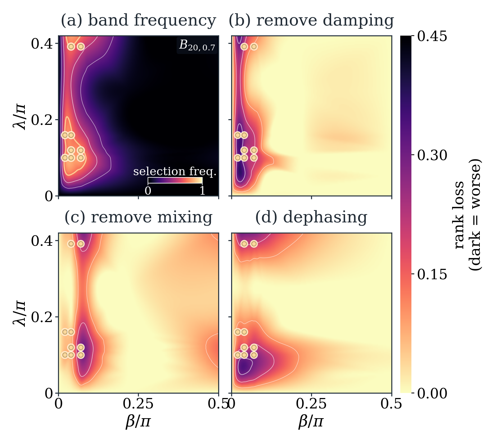
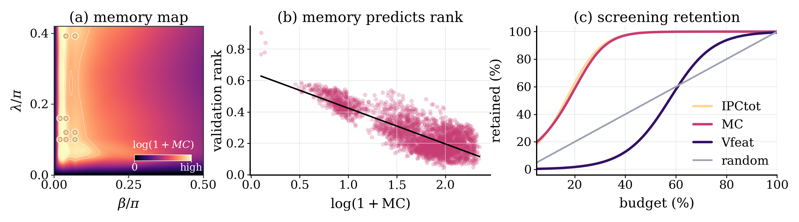
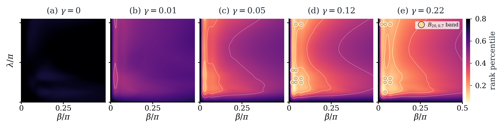

# QRC Phase Diagram

Publication repository for the QRC-only short paper:

**Where a Quantum Reservoir Works: A Transferable Operating Band**

Code and data availability: [project repository](https://github.com/eybmits/qrc_phase_diagram)

## Reproducibility package

Complete, versioned material for this submission is available at:

- Repository: https://github.com/eybmits/qrc_phase_diagram
- Artifact tag: `v1.0.0-repro` (this commit)
- DOI: not yet assigned

The package contains:

- Simulator and experiment code: `scripts/qrc_stateful_minimal_suite.py`, `scripts/run_qrc_phase_grid.py`, `scripts/run_qrc_phase_ablation_slices.py`, `scripts/analyze_phase_map_generalization.py`.
- Selection and diagnostic code: `scripts/analyze_phase_map_generalization.py`, `scripts/analyze_qrc_intrinsic_diagnostics.py`, `scripts/make_figures_and_build_data.py`.
- Fixed grid and seed definitions: `scripts/run_qrc_phase_grid.py` and `scripts/run_qrc_phase_ablation_slices.py` (`beta/\pi`, `lambda/\pi`, `gamma` grids; seeds `42..61`).
- Checked-in result files under `data/` (CSV/JSON summaries and intermediate artifacts).
- Figure/table generation and manuscript integration scripts under `scripts/` and `paper/`.

Exact reproduction workflow from checked-in artifacts (regenerates Figs. 1–4 and Tables I–II):

```bash
./reproduce_from_artifacts.sh
```

For anonymous review, use the same tagged material through the submission-specific mirror.

## Paper

## Paper

- [PDF](paper/qrc_phase_diagram.pdf)
- TeX submission ZIP: `dist/qrc_phase_diagram_tex_package.zip`

## Figures









Extra repository figure:



## Reproduce

```bash
python -m venv .venv
source .venv/bin/activate
pip install -r requirements.txt
./reproduce.sh
```

`./reproduce.sh` rebuilds the checked-in CSV/JSON summaries, the four paper figures, the supplemental wide damping atlas, generated TeX numbers, and the 4-page `paper/qrc_phase_diagram.pdf`.

## Main Artifacts

- `data/qrc_seed_ensemble_grid.csv`: base 4q/2-layer QRC phase grid, 23,520 rows.
- `data/qrc_architecture_robustness_grid.csv`: 4q/3-layer robustness grid, 23,520 rows.
- `data/qrc_phase_ablation_slice_grid.csv`: mechanism ablation slice grid, 27,440 rows.
- `data/phase_map_generalization_stats.json`: operating-band, transfer, holdout, robustness, and ablation statistics.
- `data/qrc_real_current_intrinsic_diagnostics.csv`: intrinsic memory/IPC diagnostics.
- `paper/generated/phase_map_numbers.tex`: generated manuscript numbers.
- `paper/gfx/`: final figure PDFs and PNG previews.

## Docs

- [Reproducibility](docs/reproducibility.md)
- [Data manifest](docs/data_manifest.md)
